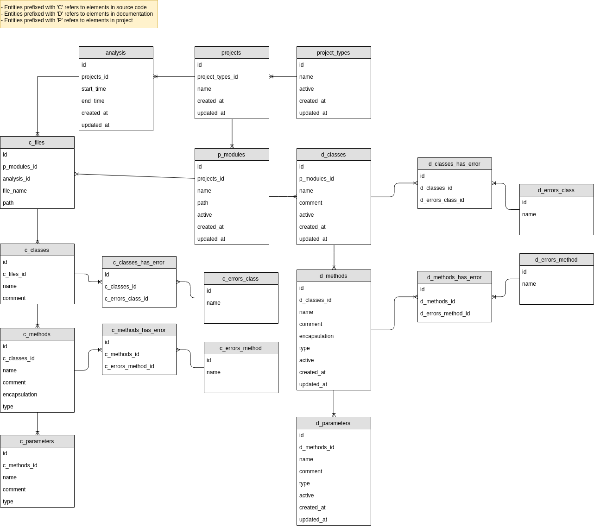

Codelizer service
=================
Codelizer is a platform to analyze the source code of java projects,
it subtracts data and metrics from your code with the goal of be processed
and used for your own purposes.

The platform is composed of multiple services.<br/>
Specifically the **Codelizer service** *(This repository)* is the agent
that processes the java source code of the projects and collects information
about:

* The declared classes
* The declared methods
* The parameters declared on each method
* The documentation of classes and methods
* The documentation of method parameters

The agent only collects information and puts it into the database, what to
do with that info is out of the scope of this service, that is responsibility
of another components of platform.

The database looks like:


## How the analysis is done?
This service exposes a list of web services, the idea is that another system
invokes that web services. Once that web service is invoked, each java file of
a given project is analyzed. A grammar tree is built and the relevant
element are subtracted from this tree. In resume:

1. A webservice is invoked to start the analysis
2. The service looks for all java files in root folder of specified project
3. Each java file is processed and a grammar tree is generated
4. The relevant items are subtracted from the grammar tree
5. The subtracted elements are stored into the database

## How to work with this service?

Compile with:
```bash
mvn clean install
```

Run it with:
```bash
java -jar <file.jar>
```